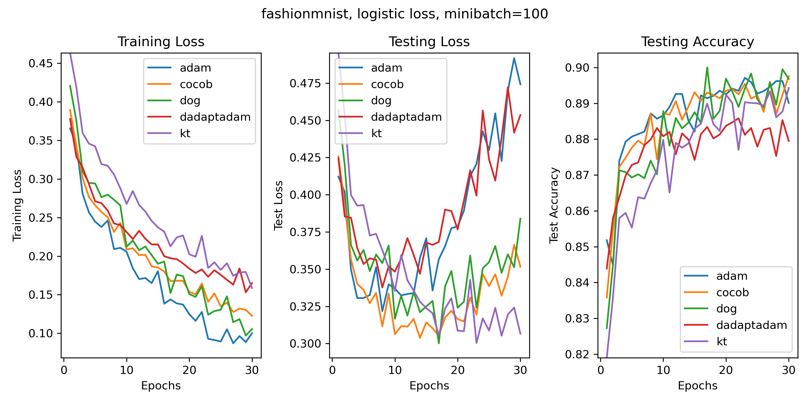

# Parameter-Free
Parameter-Free Optimizers for PyTorch

This is a library for parameter-free optimization in PyTorch. Parameter-free is a technical term that denotes a certain ability of an optimization algorithm to adapt to the unknown distance to the optimal solution. But in practice it means ``SGD without learning rates'' :)

## Installation
To install the package, simply run `pip install parameterfree`.

## Usage
All the parameter-free algorithms are implemented using the standard PyTorch optimizer interface. After installing with pip, you can simply import and use any of them in your code. For example, to use COCOB, write
```python
from parameterfree import COCOB
optimizer = COCOB(optimizer args)
```
where `optimizer args` follows the standard PyTorch optimizer syntax. 

## Details

There have been many parameter-free algorithms proposed over the past 10 years.
Some of them work very well, even winning Kaggle competitions, some others are mainly interesting from a theoretical point of view.
However, the original code of many of this algorithms got lost or the authors stopped maintaining them.
This also makes it difficult to compare recent algorithms with previous variants.

Moreover, people in this field like me know that it is possible to combine tricks and reductions, like LEGO blocks, to obtain even more powerful parameter-free algorithms. However, there is essentially no code available, but only long papers full of math :)

So, I decided to write a single library to gather all the parameter-free algorithms I know and possibly of some interesting and easy to obtain variants.
I'll add them slowly over time.
Here the current implemented algorithms:

- **COCOB** This is the first parameter-free algorithms specifically designed for deep learning. The original code was in Tensorflow. It was used to win a [Kaggle competition](https://github.com/Arturus/kaggle-web-traffic/tree/master). The paper is 
*Francesco Orabona, Tatiana Tommasi. Training Deep Networks without Learning Rates Through Coin Betting.
 [NeurIPS'17](https://arxiv.org/abs/1705.07795)*

- **KT** First parameter-free algorithm based on the coin-betting framework. Code never released. *Warning:* KT might diverge if the stochastic gradients are not bounded in L2 norm by 1, so it is safe to use only with gradient clipping. The paper is 
*Francesco Orabona, Dávid Pál. Coin Betting and Parameter-Free Online Learning.
 [NeurIPS'16](https://arxiv.org/abs/1602.04128)*

# Generalization and Parameter-Free Algorithms

It is well-known that the learning rate of the optimization algorithm also influences the generalization performance. So, what happens to the generalization of a deep network trained with a parameter-free algorithm? Well, it is very difficult to say because we do not have a strong theory of how generalization work in deep networks. In general, if your network does not overfit the data with the usual optimizers, it won't overfit with parameter-free algorithms. However, if your network tend to overfit and you have to set the learning rate carefully to avoid it, parameter-free algorithms might overfit.

From my personal point of view, slowing down the optimizer to increase the generalization performance is a bad idea because you are entangling two different things: optimization and generalization. I instead suggest to use the most aggressive optimization procedure coupled with a regularization method. In this way, the optimizer just has to worry about optimizing functions and the regularizer will take care of the generalization, separating these two aspects.

On the other hand, there is a recent trend on training only for 1-2 epochs on massive datasets. This is particularly true for large language models. It is very easy to show that it is impossible to overfit with only 1 epochs. The reason is that with only 1 epoch you are directly optimizing the *test loss*, together with the training loss. This is not strictly true after the first epoch, but it is still approximately true if the number of epochs is small, let's say 2-3. In this cases, parameter-free algorithms make perfect sense!
 
# Other Parameter-Free Algorithms

Recently parameter-free algorithms have become more popular, especially after the discovery that it is possible to design them in the primal space too.
Here, the links to some other software for PyTorch.

- **DoG** This algorithm is based on SGD with a parameter-free tuning of the learning rate. (https://github.com/formll/dog)

- **D-Adaptation** Similar to the one above, but this is based on FTRL/DA instead of SGD. (https://github.com/facebookresearch/dadaptation/)
 
# Preliminary Experiments

Probably due to the lack of reliable software, a comprehensive benchmark of parameter-free algorithms is missing. I plan to do one and please contact me if you want to help. In the while, here some toy experiments, just to show you that these algorithms do work.


FashionMNIST, 2 fully connected hidden layers with 1000 hidden units each and ReLU activations, mini-batch size of 100. Constant default settings for Adam.

# License
See the [License file](/LICENSE).
